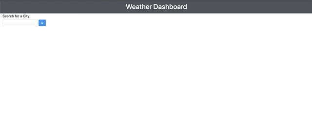
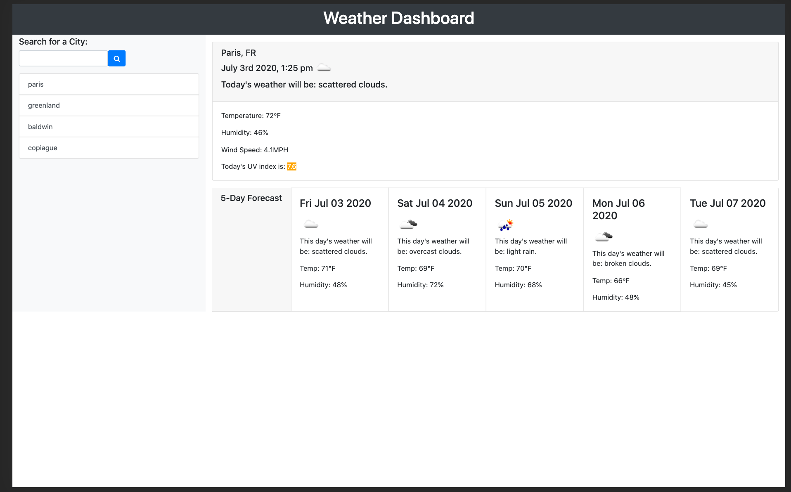
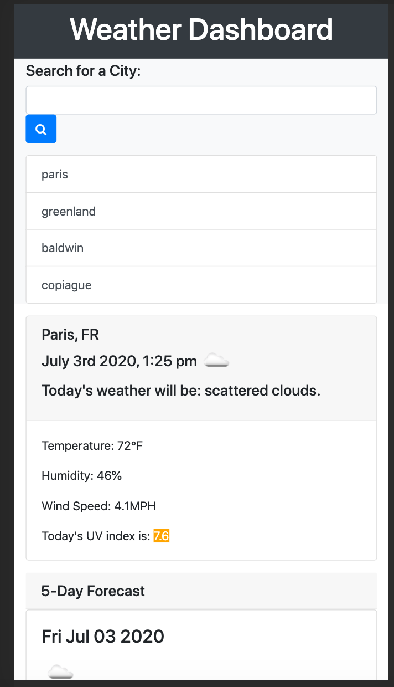

# Weather Web Application 

This website was made using Bootstrap as a CSS framework; HTML, Javascript, and OpenWeatherMap's API (https://openweathermap.org/) to to dynamically create a weather web-based application that is responsive across many devices. 

The user can search any city in the search field, and once the search button is clicked, the city's current weather, including temperature, UV Index, Humidity and the current date will show. The UV Index color will change dependent on how high or low the city's UV Index is for the current date. Addtionally the user's search history will be stored in local storage. 

### Application Link: 
https://microxgleek94.github.io/Weather-App/

## Below is a demo of the working application

## Application Screenshots of Mobile and Desktop Views : 
 

# Contact
  
 
  

  
**Contact email:** kiki_hanson@aol.com
  
**GitHub Username:**  https://github.com/microxgleek94
  
**Best form of contact:** Email
  
**GitHub Project link:** hhttps://github.com/microxgleek94/Weather-App
